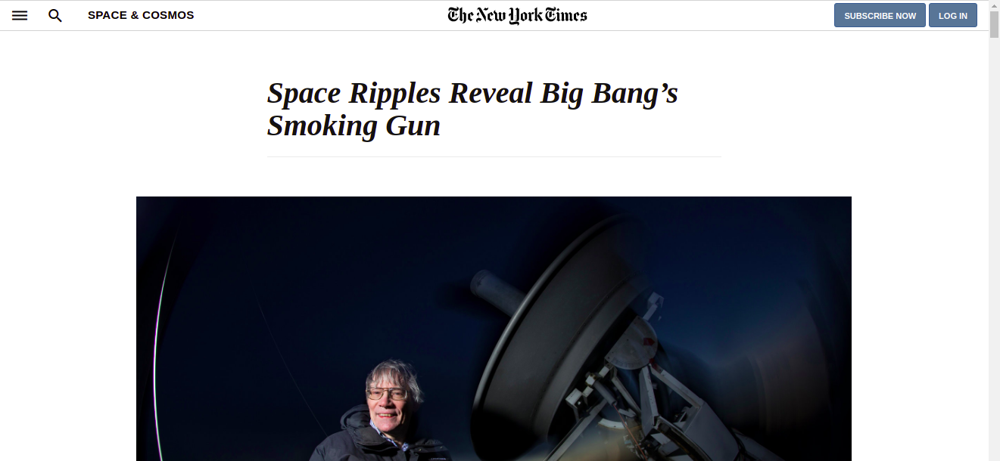
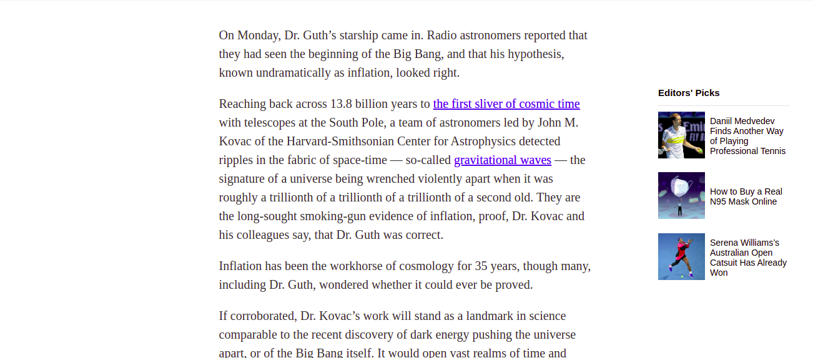
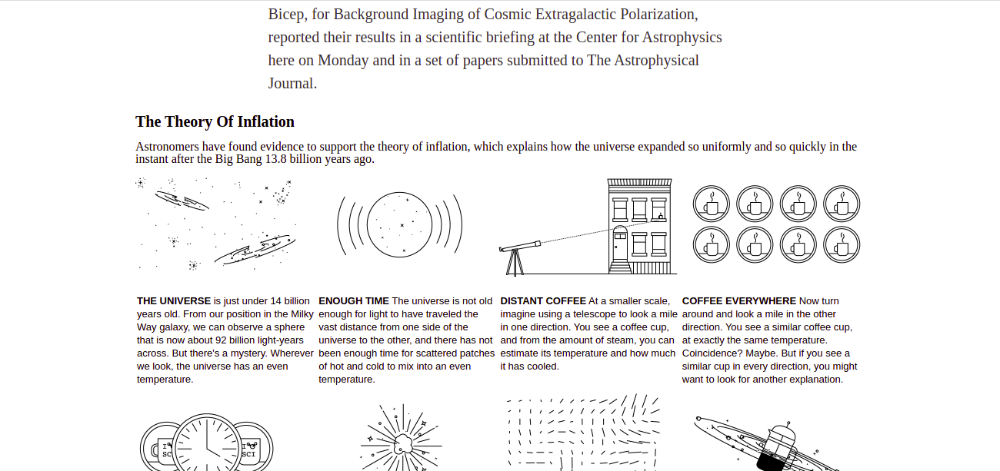

# Clone Webpage from The New York Times

> This is a clone of The New York Times article [Space Ripples Reveal Big Bang’s Smoking Gun](https://www.nytimes.com/2014/03/18/science/space/detection-of-waves-in-space-buttresses-landmark-theory-of-big-bang.html).

The main purpose of this project is practicing **Layout**, **Flexbox** and **Grid**. Indispensable concepts for a Web Developer.  

## Built With

- HTML/CSS

## Live Demo

[Live Demo Link](https://john-arboleda.github.io/NYT-clone-project-1/)

To get a local copy up and running follow these simple example steps.

### Prerequisites

- Having any popular browser like Chrome, Firefox, Edge, Safari

### Setup

- Download or clone this repository on your computer, run the index.html file with a browser

## Authors

👤 **John Arboleda**

- GitHub: [@john-arboleda](https://github.com/John-Arboleda)

## 🤝 Contributing

Contributions, issues, and feature requests are welcome!

Feel free to check the [issues page](issues/).

## Show your support

Give a ⭐️ if you like this project!

## Acknowledgments

- Hat tip to anyone whose code was used
- Inspiration
- etc

## 📝 License

This project is [MIT](lic.url) licensed.
